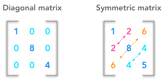
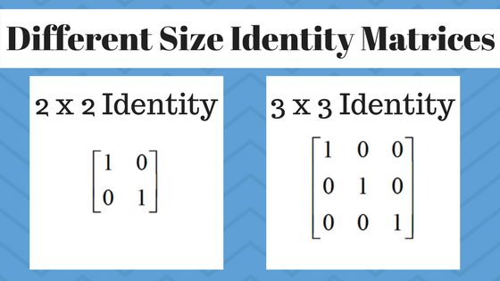
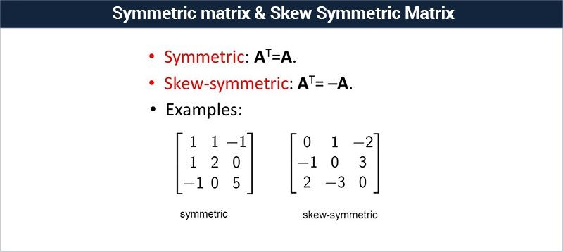
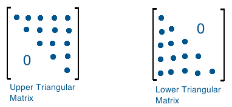
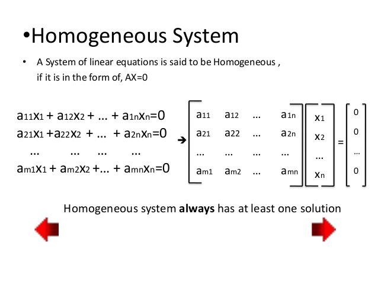
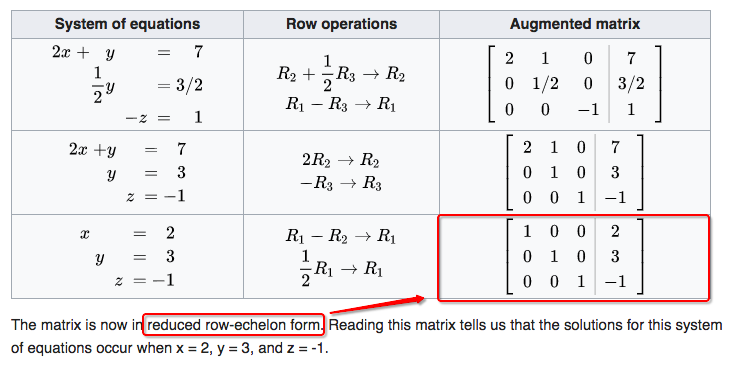
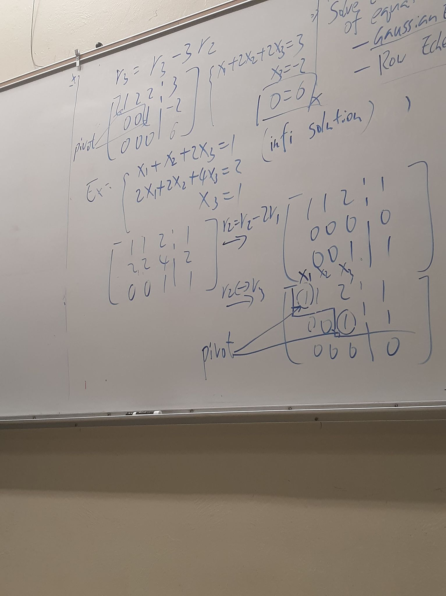

# Daily Notes

## 01/17/20
R* = [r*]nq = BC

S* = [s*]mq = A(BC)

Sij* = [s*]mq = A(BC)

3)A(B + C) = AB + AC

4)(B + C)A = BA + CA

5)AB = 0 => A=0 or B=0

    Ex: let A =|4 2| , B = |3 -4|
               |2 1|,      |-6 8|

        AB = |0 0|
             |0 0|2x2

### Transpose:
Definition: if A = [aij]i=1...nj=1...p is a nxp matrix then the transpose of A denoted by AT= [aji] is an pxn matrix.

    Ex: A = |1 2 3|,    AT|1 4|
            |4 5 6|                  |2 5|
                                     |3 6|

### Transpose properties
1) (AT)T = A

2) 	(lambda(A))T = lambda(A)T

3) (A + B) T = AT + BT

4) (AB)T = BTAT

5) (ABC)T = [(AB)C]T = CT(AB)T = CTATBT

### Special matrix

### Diagonal matrix
Is a square matrix with all elements except those on the main diagonal equal to zero.

### Identity matrix
Diagonal matrix with all diagonal element equal to 1.

A * I = A, I * A = A

### Symmetric Matrices
Definition:

- 1) symmetric Matrix A = AT
- 2) skew-symmetric matrix A = -AT

### Lower/Upper triangular matrices:

A matrix A = [a<ij] is called
 - lower triangular if aij = 0, for j>i
 - upper triangular if aij = 0, for i>j

 

### Linear system of equations.

a11x1 + a12x2 + ... + a1nxn = b1

---

## 01/22/20 The system of equations can be written as augmented matrix:

A = [A;B]

For homogenous system there is at least one solution.

### Gaussian Elimination
1. two rows (ri<->ri)
2. a scalar times one row (ri=(scalar)ri)
3. Add one row by a scalar times another row (ri= ri + (scalar)ri)

x1 + 3x2 = 4 A = |1 3 |4|  
2x1 - x2 = 1 &nbsp; &nbsp; &nbsp; &nbsp;&nbsp; |2 -1|1|  
3x1 + 2x2 = 5&nbsp; &nbsp; &nbsp;&nbsp;|3  2|5| 
5x1 + 15x2 = 20&nbsp;&nbsp;&nbsp;|

### Goal Gaussian Elimination

1. an upper triangular form.
2. main diagonal to be unity.

### Basic Principles

1. Completely reduce one column before considering another column.
2. work on column in order from left to right.

### Types of solutions:
1. no solutions
* No solutions when bottom row has all zeroes but right column is Non-zero
2. unique solutions
* if not a `no solution` and # of pivot == # of variables
3. infinite solutions
* if not a `no solution` and # of pivot < # of variables

### Row Echelon Form

### pivot
Want to follow pivot when writing down answer 
x1 = x2 - 1 
x2 = infinite solutions 
x3 = 1

### left column is not Echelon Form right column is Echelon Form
